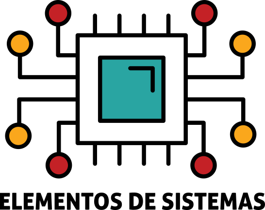

In this page we show examples of general text editing using Markdown, a plain text way used to write formatted text, or MDX, a Markdown extension that accepts JSX components.

Other references:

- General markdown:
  - https://commonmark.org/help/
  - https://github.com/adam-p/markdown-here/wiki/Markdown-Cheatsheet
  - https://www.markdownguide.org/basic-syntax/
- MDX:
  - https://mdxjs.com/
- Specific:
  - https://astro.build/

## Headers

In _Interactive Handouts_ headers are used to create the _Table of contents_ shown on the right side of the page. To create a heading, add `#` in front of a word or phrase. The number of `#` impacts the heading level. Level 1 headers `# Like this` are reserved for the title of the page.

## `## Heading level 2`

### `### Heading level 3`

#### `#### Heading level 4`

## Text

Text is added by... just writing text. Paragraphs are separated by an empty line.

<ah-tabbed>
  <label slot="label">Result</label>
  <div slot="content">
  This is a single paragraph
  even though it is split in three
  lines.
  </div>

  <label slot="label">Markdown</label>
  <div slot="content">
  ```md
  This is a single paragraph
  even though it is split in three
  lines.
  ```
  </div>
</ah-tabbed>

## Bold, italics and other text emphasis

Basic formatting can be done using simple text annotations. See the example below for some common text formatting.

<ah-tabbed>
  <label slot="label">Result</label>
  <div slot="content">
  It is very easy to type **bold**, _italic_ and `monospaced` text. We can also ==highlight==, ~~strikethrough~~ and ^^underline^^ text. All these **can _be applied_ ==together and may span== ^^many words^^.**. We can also put type ^superscript^ and ~subscript~ text.
  </div>

  <label slot="label">Markdown</label>
  <div slot="content">
  ```md
  It is very easy to type **bold**, _italic_ and `monospaced` text. We can also ==highlight==, ~~strikethrough~~ and ^^underline^^ text. All these **can _be applied_ ==together and may span== ^^many words^^.**. We can also put type ^superscript^ and ~subscript~ text.
  ```
  </div>
</ah-tabbed>

## Lists

Lists can be made as follows:

<ah-tabbed>
  <label slot="label">Unordered list</label>
  <div slot="content">
  *Result:*

  - First item
  - Second item
  - Third item
      - Sub item 1
      - Sub item 2

  *Markdown:*

  ```md
  - First item
  - Second item
  - Third item
      - Sub item 1
      - Sub item 2
  ```
  </div>

  <label slot="label">Ordered list</label>
  <div slot="content">
  _Result:_

  1. First item
  1. Second item
  1. Third item
      1. Sub item 1
      1. Sub item 2

  *Markdown:*

  ```md
  1. First item
  1. Second item
  1. Third item
      1. Sub item 1
      1. Sub item 2
  ```
  </div>

  <label slot="label">Check list</label>
  <div slot="content">
  _Result:_

  - [ ] No checked
  - [x] Checked item

  *Markdown:*

  ```md
  - [ ] No checked
  - [x] Checked item
  ```
  </div>
</ah-tabbed>

## Images

You can add images with ``.

<ah-tabbed>
  <label slot="label">Result</label>
  <div slot="content">
  
  </div>

  <label slot="label">Markdown</label>
  <div slot="content">
  ```md
  
  ```
  </div>
</ah-tabbed>
